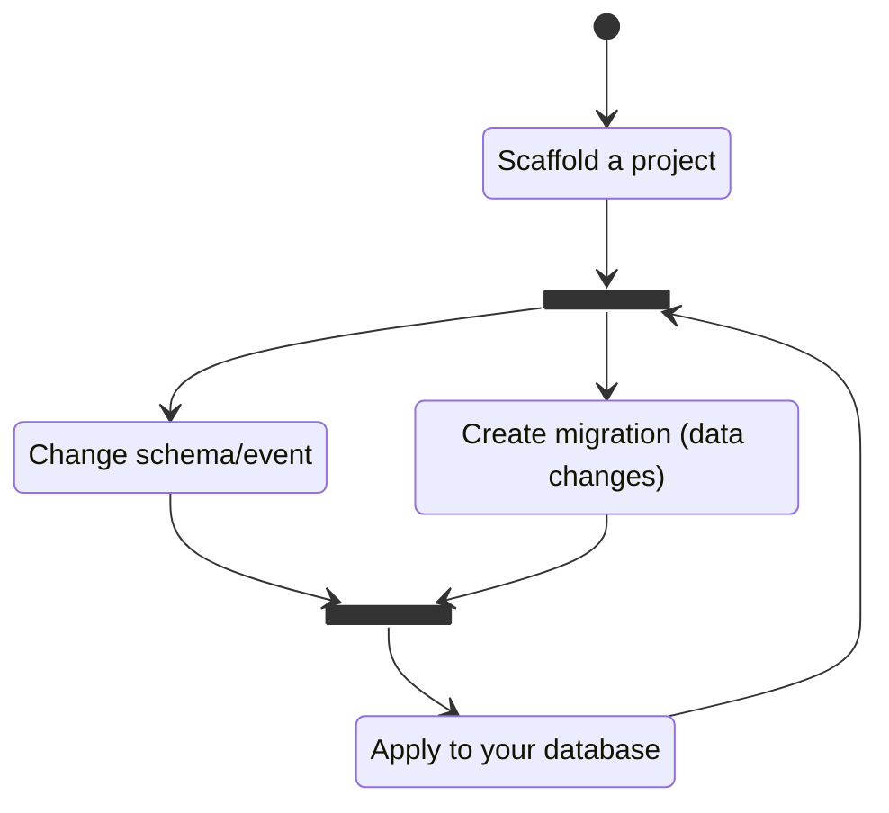

   [](https://codecov.io/gh/Odonno/surrealdb-migrations)

# SurrealDB Migrations

An awesome SurrealDB migration tool, with a user-friendly CLI and a versatile Rust library that enables seamless integration into any project.

> **Warning**
> This project is not production-ready, use at your own risk.

This project can be used:

- as a Rust library

```
cargo add surrealdb-migrations
```

- or as a CLI

```
cargo install surrealdb-migrations
```

- or inside a CI workflow, using a GitHub Action

Check [surrealdb-migrations](https://github.com/marketplace/actions/surrealdb-migrations) GitHub Action in the marketplace

## The philosophy

The SurrealDB Migrations project aims to simplify the creation of a SurrealDB database schema and the evolution of the database through migrations. A typical SurrealDB migration project is divided into 3 categories: schema, event and migration.

A schema file represents no more than one SurrealDB table. The list of schemas can be seen as the Query model (in a CQRS pattern). The `schemas` folder can be seen as a view of the current data model.

An event file represents no more than one SurrealDB event and the underlying table. The list of events can be seen as the Command model (in a CQRS pattern). The `events` folder can be seen as a view of the different ways to update the data model.

A migration file represents a change in SurrealDB data. It can be a change in the point of time between two schema changes. Examples are: when a column is renamed or dropped, when a table is renamed or dropped, when a new data is required (with default value), etc...

## Get started



### 1. Scaffold

You can start a migration project by scaffolding a new project using the following command line:

```
surrealdb-migrations scaffold template empty
```

This will create the necessary folders and files in order to perform migrations. The `empty` template should look like this:

- /schemas
  - script_migration.surql
- /events
- /migrations

There are a number of pre-defined templates so you can play around and get started quickly.

### 2. Change schema and/or create data change migrations

Once you have created your migration project, you can start writing your own model. Based on the folders you saw earlier, you can create schema files, event files and migration files.

#### Schemas

You can create strict schema files that represent tables stored in SurrealDB.

```
surrealdb-migrations create schema post --fields title,content,author,created_at,status
```

This will create a schemaless table with predefined fields:

```surql
DEFINE TABLE post SCHEMALESS;

DEFINE FIELD title ON post;
DEFINE FIELD content ON post;
DEFINE FIELD author ON post;
DEFINE FIELD created_at ON post;
DEFINE FIELD status ON post;
```

#### Events

You can also create events in the same way.

```
surrealdb-migrations create event publish_post --fields post_id,created_at
```

This will define a table event with predefined fields:

```surql
DEFINE TABLE publish_post SCHEMALESS;

DEFINE FIELD post_id ON publish_post;
DEFINE FIELD created_at ON publish_post;

DEFINE EVENT publish_post ON TABLE publish_post WHEN $before == NONE THEN (
    # TODO
);
```

#### Migrations

And when updating data, you can create migration files this way:

```
surrealdb-migrations create AddAdminUser
```

This will create a new file using the current date & time of the day, like `20230317_153201_AddAdminUser.surql` for example. All migrations files should be listed in a temporal order.

### 3. Apply to your database

Finally, when you are ready, you can apply your schema and migrations to the database using the following command line:

```
surrealdb-migrations apply
```

Or directly inside your Rust project using the following code:

```rust
use surrealdb_migrations::MigrationRunner;
use surrealdb::engine::any::connect;
use surrealdb::opt::auth::Root;

#[tokio::main]
async fn main() -> Result<()> {
    let db = connect("ws://localhost:8000").await?;

    // Signin as a namespace, database, or root user
    db.signin(Root {
        username: "root",
        password: "root",
    }).await?;

    // Select a specific namespace / database
    db.use_ns("namespace").use_db("database").await?;

    // Apply all migrations
    MigrationRunner::new(&db)
        .up()
        .await
        .expect("Failed to apply migrations");

    Ok(())
}
```

### 4. Repeat

Repeat the process from step 2. Change schema and/or create data change migrations.

## Predefined templates

To help you get started quickly, there is a list of predefined templates you can use:

| Template                         | Description                                                                                                                                           |
| -------------------------------- | ----------------------------------------------------------------------------------------------------------------------------------------------------- |
| [empty](templates/empty)         | The smallest migration project you can create.<br /> A clean schema with an already defined `script_migration` table to store the applied migrations. |
| [blog](templates/blog)           | A blog domain model, with users having the ability to publish/unpublish posts and comments.                                                           |
| [ecommerce](templates/ecommerce) | An ecommerce domain model, with customers having the ability to purchase products.                                                                    |

You can scaffold a project using any of these templates using the following command line:

```
surrealdb-migrations scaffold template <TEMPLATE>
```

## Configuration

You can create a `.surrealdb` configuration file at the root of your project. This way you won't have to set the same configuration values every time.

```toml
[core]
    path = "./tests-files"
    schema = "less"

[db]
    address = "ws://localhost:8000"
    username = "root"
    password = "root"
    ns = "test"
    db = "test"
```

In the `core` section, you can define the path to your schema/migration files, if it is not the current folder.

In the `db` section, you can define the values used to access your SurrealDB database. It can be the `url`, `username`, `password`, the namespace `ns` or the name of the database `db`.

Here is the definition of the `.surrealdb` configuration file:

```toml
[core]
    # Optional
    # Type: String
    # Description: Path to the folder that contains your migration project (root folder by default)
    # Default: "."
    path

    # Optional
    # Type: "less" | "full"
    # Description: Define SCHEMALESS or SCHEMAFULL option by default when creating new table/event file
    # Default: "less"
    schema

[db]
    # Optional
    # Type: String
    # Description: Address of the surrealdb instance
    # Default: "ws://localhost:8000"
    address

    # Optional
    # Type: String
    # Description: Username used to authenticate to the surrealdb instance
    # Default: "root"
    username

    # Optional
    # Type: String
    # Description: Password used to authenticate to the surrealdb instance
    # Default: "root"
    password

    # Optional
    # Type: String
    # Description: Namespace to use inside the surrealdb instance
    # Default: "test"
    ns

    # Optional
    # Type: String
    # Description: Name of the database to use inside the surrealdb instance
    # Default: "test"
    db
```

## Backward migrations

By default, migrations are forward-only. However, it can be interesting to revert a migration in order to undo a mistake. You will find backward migrations in two places:

1. Inside the `/migrations/down` folder with the same name as your forward migration
2. Inside the `/migrations` but with the `.down.surql` extension next to the forward migration

So, a migration project with backward migrations might look like this:

- /schemas
  - script_migration.surql
- /events
- /migrations
  - 20231605_205201_AddProduct.surql
  - /down
    - 20231605_205201_AddProduct.surql

Or like this:

- /schemas
  - script_migration.surql
- /events
- /migrations
  - 20231605_205201_AddProduct.surql
  - 20231605_205201_AddProduct.down.surql

If you want to create a DOWN migration file when creating the migration file, use this command:

```
surrealdb-migrations create AddProduct --down
```

If you need to, you can revert all migrations back to the one you specified.

```
surrealdb-migrations apply --down 20231605_205201_AddProduct
```

And if you need to undo all your migrations, use this command:

```
surrealdb-migrations apply --down 0
```

## Samples

This project contains sample apps that demontrates how to use the `surrealdb-migrations` given certain contexts. Here is a list of existing samples:

| Name                 | Description                                                                                                                                                                                                                                                   | Languages/Frameworks  |
| -------------------- | ------------------------------------------------------------------------------------------------------------------------------------------------------------------------------------------------------------------------------------------------------------- | --------------------- |
| [wasm](samples/wasm) | This project shows how to use the `surrealdb-migrations` crate with embedded migrations files in a WASM context.<br /> The app entry point is powered by SvelteKit and the `vite-plugin-rsw` plugin.<br /> The SurrealDB data is stored locally in IndexedDb. | SvelteKit/Rust (WASM) |

## Let's see Paul Allen's contributions

Thanks goes to these wonderful people ([emoji key](https://allcontributors.org/docs/en/emoji-key)):

<!-- ALL-CONTRIBUTORS-LIST:START - Do not remove or modify this section -->
<!-- prettier-ignore-start -->
<!-- markdownlint-disable -->
<table>
  <tbody>
    <tr>
      <td align="center" valign="top" width="14.28%"><a href="http://www.tekacs.com/"><br /><sub><b>Amar Sood</b></sub></a><br /><a href="https://github.com/Odonno/surrealdb-migrations/commits?author=tekacs" title="Code">💻</a></td>
      <td align="center" valign="top" width="14.28%"><a href="https://github.com/Roms1383"><br /><sub><b>Rom's</b></sub></a><br /><a href="https://github.com/Odonno/surrealdb-migrations/commits?author=Roms1383" title="Code">💻</a> <a href="#ideas-Roms1383" title="Ideas, Planning, & Feedback">🤔</a> <a href="#infra-Roms1383" title="Infrastructure (Hosting, Build-Tools, etc)">🚇</a></td>
      <td align="center" valign="top" width="14.28%"><a href="https://github.com/pranaypratyush"><br /><sub><b>Pranay Pratyush</b></sub></a><br /><a href="https://github.com/Odonno/surrealdb-migrations/issues?q=author%3Apranaypratyush" title="Bug reports">🐛</a></td>
      <td align="center" valign="top" width="14.28%"><a href="https://github.com/ansarizafar"><br /><sub><b>Zafar Ansari</b></sub></a><br /><a href="#ideas-ansarizafar" title="Ideas, Planning, & Feedback">🤔</a></td>
      <td align="center" valign="top" width="14.28%"><a href="https://turulix.de/"><br /><sub><b>Tim</b></sub></a><br /><a href="#ideas-turulix" title="Ideas, Planning, & Feedback">🤔</a></td>
      <td align="center" valign="top" width="14.28%"><a href="https://github.com/snarkipus"><br /><sub><b>Matt Jackson</b></sub></a><br /><a href="https://github.com/Odonno/surrealdb-migrations/issues?q=author%3Asnarkipus" title="Bug reports">🐛</a></td>
    </tr>
  </tbody>
</table>

<!-- markdownlint-restore -->
<!-- prettier-ignore-end -->

<!-- ALL-CONTRIBUTORS-LIST:END -->

This project follows the [all-contributors](https://github.com/all-contributors/all-contributors) specification. Contributions of any kind welcome!

## Credits

Inspired by awesome projects:

- [Entity Framework](https://github.com/dotnet/efcore)
- [Fluent Migrator](https://github.com/fluentmigrator/fluentmigrator)
- [kards-social](https://github.com/theopensource-company/kards-social) by Micha de Vries [@kearfy](https://github.com/kearfy)
