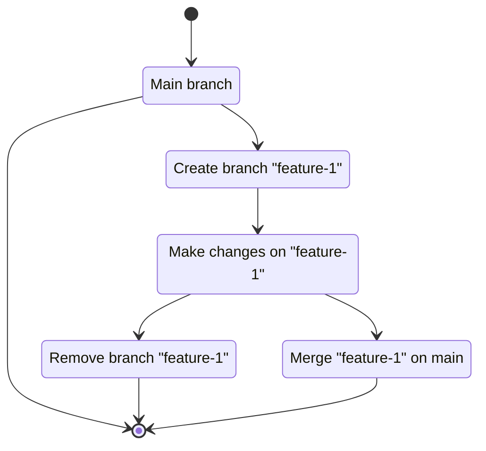

   [](https://codecov.io/gh/Odonno/surrealdb-migrations)

# SurrealDB Migrations

An awesome SurrealDB migration tool, with a user-friendly CLI and a versatile Rust library that enables seamless integration into any project.

> **Warning**
> This project is not production-ready, use at your own risk.

This project can be used:

- as a Rust library

```bash
cargo add surrealdb-migrations
```

- or as a CLI

```bash
cargo install surrealdb-migrations
```

- or inside a CI workflow, using a [GitHub Action](https://github.com/marketplace/actions/surrealdb-migrations)

Check [surrealdb-migrations](https://github.com/marketplace/actions/surrealdb-migrations) GitHub Action in the marketplace

- or even as an `initContainer` via a [Docker image](https://hub.docker.com/r/dbottiau/surrealdb-migrations)

```bash
docker pull dbottiau/surrealdb-migrations:latest
```

## The philosophy

The SurrealDB Migrations project aims to simplify the creation of a SurrealDB database schema and the evolution of the database through migrations. A typical SurrealDB migration project is divided into 3 categories: schema, event and migration.

A schema file represents no more than one SurrealDB table. The list of schemas can be seen as the Query model (in a CQRS pattern). The `schemas` folder can be seen as a view of the current data model.

An event file represents no more than one SurrealDB event and the underlying table. The list of events can be seen as the Command model (in a CQRS pattern). The `events` folder can be seen as a view of the different ways to update the data model.

A migration file represents a change in SurrealDB data. It can be a change in the point of time between two schema changes. Examples are: when a column is renamed or dropped, when a table is renamed or dropped, when a new data is required (with default value), etc...

## Get started


### 1. Scaffold

You can start a migration project by scaffolding a new project using the following command line:

```
surrealdb-migrations scaffold template empty
```

This will create the necessary folders and files in order to perform migrations. The `empty` template should look like this:

- /schemas
  - script_migration.surql
- /events
- /migrations

There are a number of pre-defined templates so you can play around and get started quickly.

### 2. Change schema and/or create data change migrations

Once you have created your migration project, you can start writing your own model. Based on the folders you saw earlier, you can create schema files, event files and migration files.

#### Schemas

You can create strict schema files that represent tables stored in SurrealDB.

```
surrealdb-migrations create schema post --fields title,content,author,created_at,status
```

This will create a schemaless table with predefined fields:

```surql
DEFINE TABLE post SCHEMALESS;

DEFINE FIELD title ON post;
DEFINE FIELD content ON post;
DEFINE FIELD author ON post;
DEFINE FIELD created_at ON post;
DEFINE FIELD status ON post;
```

#### Events

You can also create events in the same way.

```
surrealdb-migrations create event publish_post --fields post_id,created_at
```

This will define a table event with predefined fields:

```surql
DEFINE TABLE publish_post SCHEMALESS;

DEFINE FIELD post_id ON publish_post;
DEFINE FIELD created_at ON publish_post;

DEFINE EVENT publish_post ON TABLE publish_post WHEN $event == "CREATE" THEN (
    # TODO
);
```

#### Migrations

And when updating data, you can create migration files this way:

```
surrealdb-migrations create AddAdminUser
```

This will create a new file using the current date & time of the day, like `20230317_153201_AddAdminUser.surql` for example. All migrations files should be listed in a temporal order.

### 3. Apply to your database

Finally, when you are ready, you can apply your schema and migrations to the database using the following command line:

```
surrealdb-migrations apply
```

Or directly inside your Rust project using the following code:

```rust
use surrealdb_migrations::MigrationRunner;
use surrealdb::engine::any::connect;
use surrealdb::opt::auth::Root;

#[tokio::main]
async fn main() -> Result<()> {
    let db = connect("ws://localhost:8000").await?;

    // Signin as a namespace, database, or root user
    db.signin(Root {
        username: "root",
        password: "root",
    }).await?;

    // Select a specific namespace / database
    db.use_ns("namespace").use_db("database").await?;

    // Apply all migrations
    MigrationRunner::new(&db)
        .up()
        .await
        .expect("Failed to apply migrations");

    Ok(())
}
```

### 4. Repeat

Repeat the process from step 2. Change schema and/or create data change migrations.

## Predefined templates

To help you get started quickly, there is a list of predefined templates you can use:

| Template                         | Description                                                                                                                                           |
| -------------------------------- | ----------------------------------------------------------------------------------------------------------------------------------------------------- |
| [empty](templates/empty)         | The smallest migration project you can create.<br /> A clean schema with an already defined `script_migration` table to store the applied migrations. |
| [blog](templates/blog)           | A blog domain model, with users having the ability to publish/unpublish posts and comments.                                                           |
| [ecommerce](templates/ecommerce) | An ecommerce domain model, with customers having the ability to purchase products.                                                                    |

You can scaffold a project using any of these templates using the following command line:

```
surrealdb-migrations scaffold template <TEMPLATE>
```

## Configuration

### Configuration file

You can create a `.surrealdb` configuration file at the root of your project. This way you won't have to set the same configuration values every time.

```toml
[core]
    path = "./tests-files"
    schema = "less"

[db]
    address = "ws://localhost:8000"
    username = "root"
    password = "root"
    ns = "test"
    db = "test"
```

In the `core` section, you can define the path to your schema/migration files, if it is not the current folder.

In the `db` section, you can define the values used to access your SurrealDB database. It can be the `url`, `username`, `password`, the namespace `ns` or the name of the database `db`.

Here is the definition of the `.surrealdb` configuration file:

```toml
[core]
    # Optional
    # Type: String
    # Description: Path to the folder that contains your migration project (root folder by default)
    # Default: "."
    path

    # Optional
    # Type: "less" | "full"
    # Description: Define SCHEMALESS or SCHEMAFULL option by default when creating new table/event file
    # Default: "less"
    schema

[db]
    # Optional
    # Type: String
    # Description: Address of the surrealdb instance
    # Default: "ws://localhost:8000"
    address

    # Optional
    # Type: String
    # Description: Username used to authenticate to the surrealdb instance
    # Default: "root"
    username

    # Optional
    # Type: String
    # Description: Password used to authenticate to the surrealdb instance
    # Default: "root"
    password

    # Optional
    # Type: String
    # Description: Namespace to use inside the surrealdb instance
    # Default: "test"
    ns

    # Optional
    # Type: String
    # Description: Name of the database to use inside the surrealdb instance
    # Default: "test"
    db
```

### Environment variables

Here is the list of all environment variables that you can use:

* `SURREAL_MIG_PATH` - Path to the folder that contains your migration project
* `SURREAL_MIG_SCHEMA` - Define SCHEMALESS or SCHEMAFULL option by default when creating new table/event file
* `SURREAL_MIG_ADDRESS` - Address of the surrealdb instance
* `SURREAL_MIG_USER` - Username used to authenticate to the surrealdb instance
* `SURREAL_MIG_PASS` - Password used to authenticate to the surrealdb instance
* `SURREAL_MIG_NS` - Namespace to use inside the surrealdb instance
* `SURREAL_MIG_DB` - Name of the database to use inside the surrealdb instance

### Execution context

The execution context describes how configuration settings are applied and prioritized when a command is executed.

The order of execution goes like this:

```
Environment variables -> Configuration file -> CLI arguments
```

**Environment variables**: Default settings can be via environment variables. These are typically set up in the system or shell environment.

**Configuration file**: If additional customization is needed, a config file can override environment variables, offering fine-tuned settings. See the section above.

**CLI arguments**: These take precedence over both environment variables and the configuration file. CLI arguments are explicitly provided at runtime, ensuring immediate and specific customization for the specified command.

## Backward migrations

By default, migrations are forward-only. However, it can be interesting to revert a migration in order to undo a mistake. You will find backward migrations in two places:

1. Inside the `/migrations/down` folder with the same name as your forward migration
2. Inside the `/migrations` but with the `.down.surql` extension next to the forward migration

So, a migration project with backward migrations might look like this:

- /schemas
  - script_migration.surql
- /events
- /migrations
  - 20231605_205201_AddProduct.surql
  - /down
    - 20231605_205201_AddProduct.surql

Or like this:

- /schemas
  - script_migration.surql
- /events
- /migrations
  - 20231605_205201_AddProduct.surql
  - 20231605_205201_AddProduct.down.surql

If you want to create a DOWN migration file when creating the migration file, use this command:

```
surrealdb-migrations create AddProduct --down
```

If you need to, you can revert all migrations back to the one you specified.

```
surrealdb-migrations apply --down 20231605_205201_AddProduct
```

And if you need to undo all your migrations, use this command:

```
surrealdb-migrations apply --down 0
```

## Database branching

Database branching is a similar concept to version control system like Git where you manage code repositories with branches.

With database branching, you can create a separate copy or branch of the main database to perform various tasks such as testing new features, implementing changes, or running experiments. This allows developers or teams to work independently on different branches without interfering with the stability and integrity of the original database.

You can make make schemas changes, apply new migrations and/or change data on a separate branch. These changes are isolated from the main database until they are merged back, allowing for better control and organization of database changes.

### Development workflow

In a development workflow, you have a primary/main database that contains the latest features on your project. You often work on multiple features or you want to try the work of your colleagues but it messes up your development database, whether you are using migrations or not. Database branching allows you to create a fork of the main database, work on a new feature, apply schema or data changes and then merge your new changes to the main database when your feature is ready.



You start by creating a new branch using the following command line:

```
surrealdb-migrations branch new --address http://localhost:8000
```

You will then receive a message like this:

```
You can now use the branch with the following configuration:

ns: branches
db: bright-fold-1617
```

You can now make your changes on the newly generated database using `ns` and `db` properties.
When you are done with your changes, you can merge your branch to the origin branch using the following command line:

```
surrealdb-migrations branch merge bright-fold-1617 --mode all --address http://localhost:8000
```

There are 3 merge modes, each with its own interest:

| Mode        | Description                                                                                                                                                                                                                                                                                                                                                                                                      | Status      |
| ----------- | ---------------------------------------------------------------------------------------------------------------------------------------------------------------------------------------------------------------------------------------------------------------------------------------------------------------------------------------------------------------------------------------------------------------- | ----------- |
| schema-only | A diff of schema will be applied between the branch and the origin branch at the moment of the branch creation.<br /><br /> If possible, the merge will operate schema changes on the origin branch:<br /> \* defining new tables, fields, etc...<br /> \* removing tables, fields, etc...                                                                                                                       | Planned     |
| all         | As an extension to the `schema-only` mode, a diff of schema and data will be applied between the branch and the origin branch at the moment of the branch creation.<br /><br /> If possible, the merge will operate schema and data changes on the origin branch:<br /> \* defining new tables, fields, etc...<br /> \* removing tables, fields, etc...<br /> \* adding, updating or removing table rows/columns | Planned     |
| overwrite   | Merging the branch will completely destroy the origin branch and replace it with the new one.<br /> The main branch will have the schema and the data set in the merged branch.                                                                                                                                                                                                                                  | In progress |

### Production workflow

TBD

### Database restrictions

This feature requires 3 namespaces:

- `features`
- `branches`
- `branches/origin`

It is strongly recommended to avoid using one of these namespaces in your SurrealDB instance.

### Documentation

```
# create new branch from current branch with a random name, from default ns/db
surrealdb-migrations branch new
# create new branch from current branch with a name, from default ns/db
surrealdb-migrations branch new <BRANCH_NAME>
# create new branch, from a specific ns/db
surrealdb-migrations branch new --ns <NS> --db <DB>

# review diffs between original branch and the new branch
surrealdb-migrations branch diff <BRANCH_NAME>

# commit and merge branch changes to the original branch
surrealdb-migrations branch merge <BRANCH_NAME>

# remove branch (ie. rollback)
surrealdb-migrations branch remove <BRANCH_NAME>

# list all existing branches
surrealdb-migrations branch list

# display infos of a branch
surrealdb-migrations branch status <BRANCH_NAME>
surrealdb-migrations branch <BRANCH_NAME>
```

## Samples

This project contains sample apps that demontrates how to use the `surrealdb-migrations` given certain contexts. Here is a list of existing samples:

| Name                 | Description                                                                                                                                                                                                                                                   | Languages/Frameworks  |
| -------------------- | ------------------------------------------------------------------------------------------------------------------------------------------------------------------------------------------------------------------------------------------------------------- | --------------------- |
| [wasm](samples/wasm) | This project shows how to use the `surrealdb-migrations` crate with embedded migrations files in a WASM context.<br /> The app entry point is powered by SvelteKit and the `vite-plugin-rsw` plugin.<br /> The SurrealDB data is stored locally in IndexedDb. | SvelteKit/Rust (WASM) |

## Let's see Paul Allen's contributions

Thanks goes to these wonderful people ([emoji key](https://allcontributors.org/docs/en/emoji-key)):

<!-- ALL-CONTRIBUTORS-LIST:START - Do not remove or modify this section -->
<!-- prettier-ignore-start -->
<!-- markdownlint-disable -->
<table>
  <tbody>
    <tr>
      <td align="center" valign="top" width="14.28%"><a href="http://www.tekacs.com/"><br /><sub><b>Amar Sood</b></sub></a><br /><a href="https://github.com/Odonno/surrealdb-migrations/commits?author=tekacs" title="Code">💻</a></td>
      <td align="center" valign="top" width="14.28%"><a href="https://github.com/Roms1383"><br /><sub><b>Rom's</b></sub></a><br /><a href="https://github.com/Odonno/surrealdb-migrations/commits?author=Roms1383" title="Code">💻</a> <a href="#ideas-Roms1383" title="Ideas, Planning, & Feedback">🤔</a> <a href="#infra-Roms1383" title="Infrastructure (Hosting, Build-Tools, etc)">🚇</a></td>
      <td align="center" valign="top" width="14.28%"><a href="https://github.com/pranaypratyush"><br /><sub><b>Pranay Pratyush</b></sub></a><br /><a href="https://github.com/Odonno/surrealdb-migrations/issues?q=author%3Apranaypratyush" title="Bug reports">🐛</a></td>
      <td align="center" valign="top" width="14.28%"><a href="https://github.com/ansarizafar"><br /><sub><b>Zafar Ansari</b></sub></a><br /><a href="#ideas-ansarizafar" title="Ideas, Planning, & Feedback">🤔</a></td>
      <td align="center" valign="top" width="14.28%"><a href="https://turulix.de/"><br /><sub><b>Tim</b></sub></a><br /><a href="#ideas-turulix" title="Ideas, Planning, & Feedback">🤔</a></td>
      <td align="center" valign="top" width="14.28%"><a href="https://github.com/snarkipus"><br /><sub><b>Matt Jackson</b></sub></a><br /><a href="https://github.com/Odonno/surrealdb-migrations/issues?q=author%3Asnarkipus" title="Bug reports">🐛</a></td>
      <td align="center" valign="top" width="14.28%"><a href="https://keyruu.de/"><br /><sub><b>Lucas</b></sub></a><br /><a href="#ideas-Keyruu" title="Ideas, Planning, & Feedback">🤔</a></td>
    </tr>
  </tbody>
</table>

<!-- markdownlint-restore -->
<!-- prettier-ignore-end -->

<!-- ALL-CONTRIBUTORS-LIST:END -->

This project follows the [all-contributors](https://github.com/all-contributors/all-contributors) specification. Contributions of any kind welcome!

## Credits

Inspired by awesome projects:

- [Entity Framework](https://github.com/dotnet/efcore)
- [Fluent Migrator](https://github.com/fluentmigrator/fluentmigrator)
- [kards-social](https://github.com/theopensource-company/kards-social) by Micha de Vries [@kearfy](https://github.com/kearfy)
